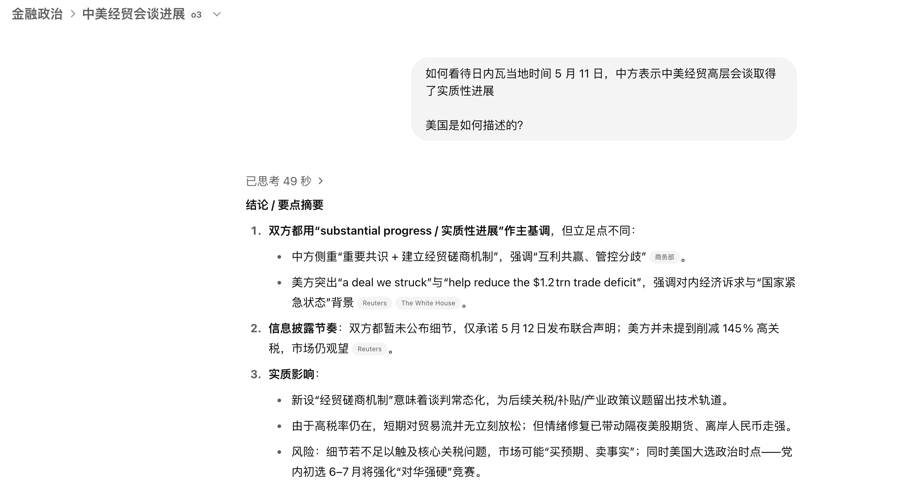
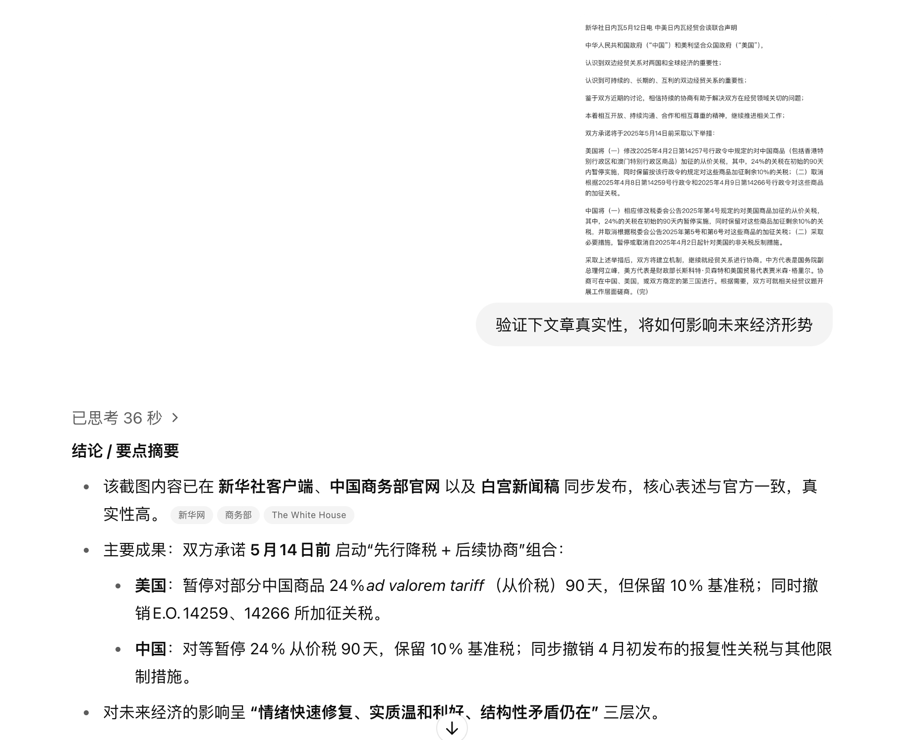
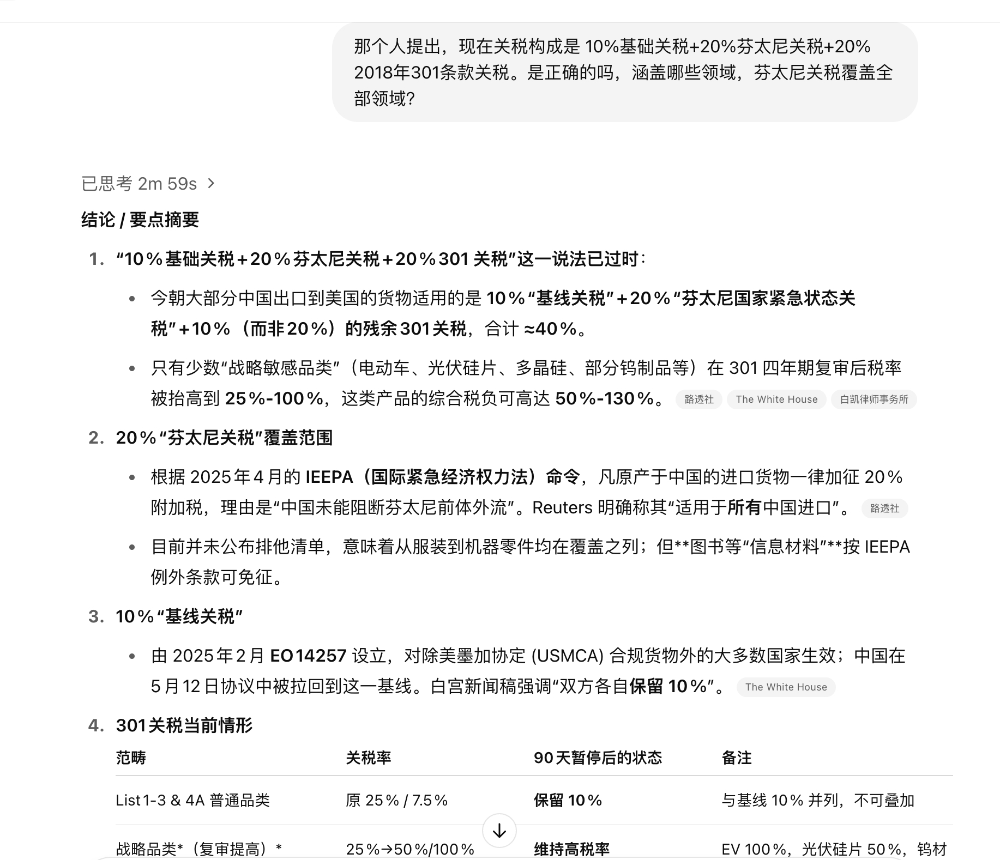
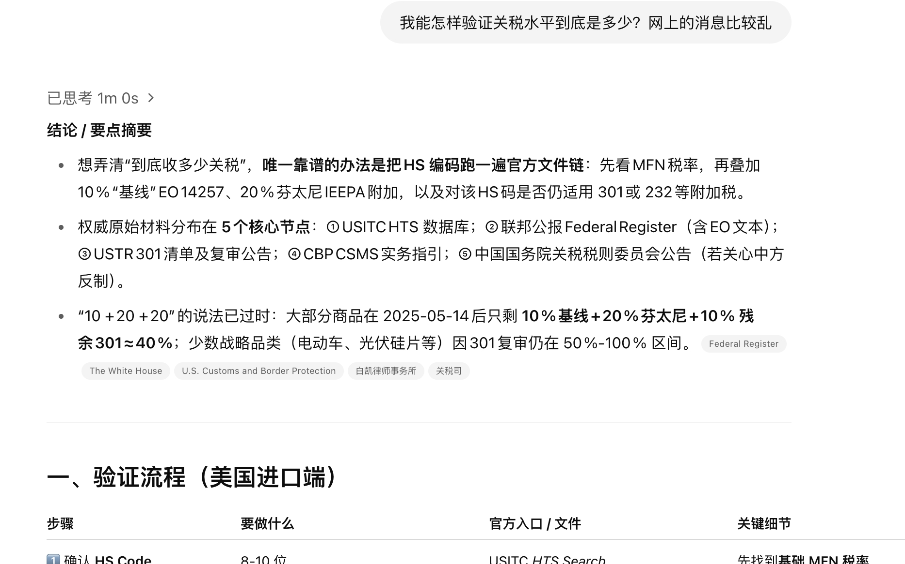
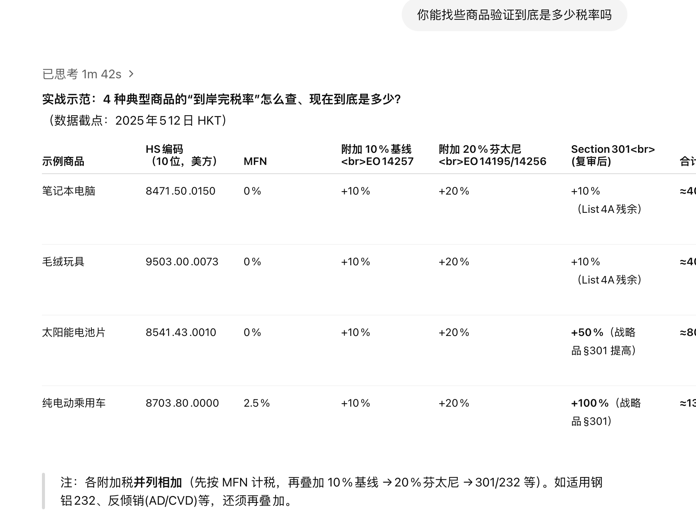
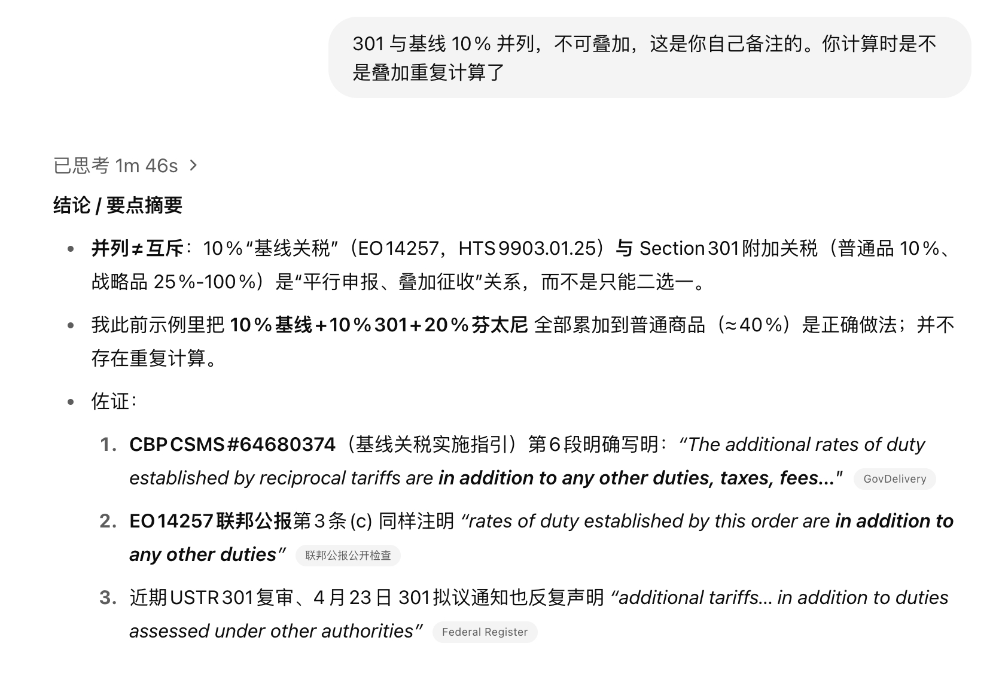
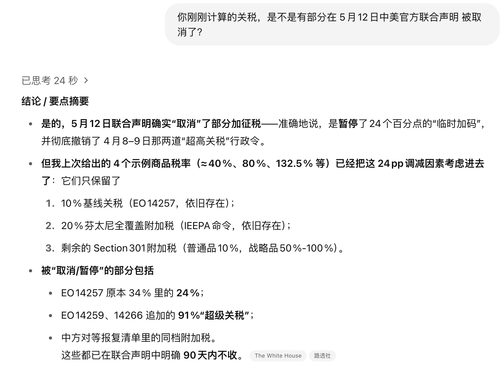
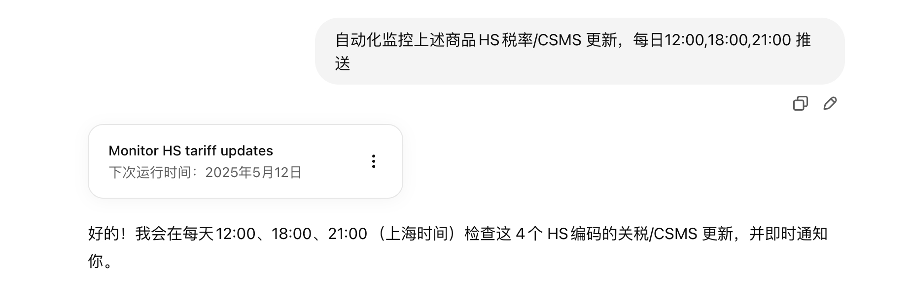

# O3 分析 25.5.12 日内瓦经贸会谈声明

抱着不能白花钱想法，分享一下

P1：5.11 时没公开内容，问下gpt美国的外宣

P2：5.12 日内瓦经贸会谈声明，问下gpt消息真实性

P3：某频道指出内宣不完整，让gpt帮忙确认下最新的关税水平

P4：请教gpt如何验证真实关税水平

P5：GPT 自己实战

P67：关税水平计算是否有误（补充询问）

P8：设置定时推送任务

以下内容为AI生成，内容仅供参考，真实性请仔细甄别

## P1

## P2

## P3

## P4

## P5

## P6

## P7

## P8
